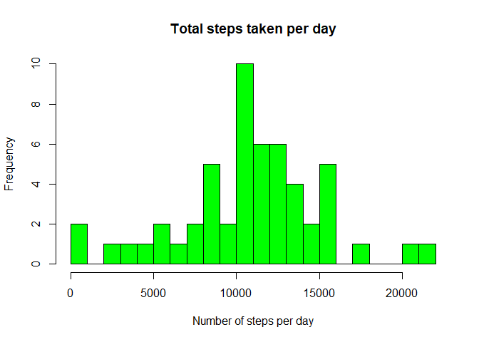

Carlos Andres Pillajo

## Loading and preprocessing the data

1. Unzipping the data and loading it into R.


```r
if (!file.exists("activity.csv") ) {
        unzip("activity.zip")
}
unzip("activity.zip")
complete_data <- read.csv("activity.csv", header = TRUE)
head(complete_data)
```

```
##   steps       date interval
## 1    NA 2012-10-01        0
## 2    NA 2012-10-01        5
## 3    NA 2012-10-01       10
## 4    NA 2012-10-01       15
## 5    NA 2012-10-01       20
## 6    NA 2012-10-01       25
```

2. Omitting NA's to start the analysis


```r
data <- na.omit(complete_data)
```

## What is mean total number of steps taken per day?

1. Building a histogram of the total number of daily steps


```r
daily_steps <- aggregate(data$steps, by = list(Steps.Date = data$date), FUN = "sum")

hist(daily_steps$x, col = "green", breaks = 20, main = "Total steps taken per day", xlab = "Number of steps per day")
```

<!-- -->

2. Mean and median of the data


```r
mean_steps <- mean(daily_steps[,2])
print (mean_steps)
```

```
## [1] 10766.19
```

```r
median_steps <- median(daily_steps[,2])
print (median_steps)
```

```
## [1] 10765
```

## What is the average daily activity pattern?

1. Time series plot to visualize the data


```r
average_day <- aggregate(data$steps, by = list(Interval = data$interval), FUN = "mean")
plot(average_day$Interval, average_day$x, type = "l",  main = "Average daily activity", ylab = "Avarage steps", xlab = "Intervals")
```

<!-- -->

2. Finding the max steps interval


```r
interval_row <- which.max(average_day$x)
max_interval <- average_day[interval_row,1]
print (max_interval)
```

```
## [1] 835
```

## Imputing missing values

1. Calculating the number of NA's in the original complete dataset


```r
NAs <- sum(is.na(complete_data$steps))
print (NAs)
```

```
## [1] 2304
```

2. Strategy for filling NA's
First, a temporary function is designed to replace the NA's of a dataset with the mean.


```r
library(dplyr)
```

```
## Warning: package 'dplyr' was built under R version 4.0.2
```

```
## 
## Attaching package: 'dplyr'
```

```
## The following objects are masked from 'package:stats':
## 
##     filter, lag
```

```
## The following objects are masked from 'package:base':
## 
##     intersect, setdiff, setequal, union
```


```r
replaceNA <- function(x) replace(x, is.na(x), mean(x, na.rm = TRUE))
```

3. Later, the Dplyr package will be used to create the new filled dataset using the functions:
  - group_by
  - mutate


```r
new_data <- complete_data%>% group_by(interval) %>% mutate(steps= replaceNA(steps))

daily_steps_filled <- aggregate(new_data$steps, by = list(Steps.Date = new_data$date), FUN = "sum")
```

4. Build of the histogram


```r
hist(daily_steps_filled$x, col = "green", breaks = 20, main = "Total steps taken per day (filled)",  xlab = "Number of steps per day")
```

<!-- -->

Presenting the mean and the median:


```r
mean_steps_filled <- mean(daily_steps_filled[,2])
print (mean_steps_filled)
```

```
## [1] 10766.19
```

```r
median_steps_filled <- median(daily_steps_filled[,2])
print (median_steps_filled)
```

```
## [1] 10766.19
```

What is the impact of filling the original dataset? It can be seen in a comparative histogram.


```r
par(mfrow = c(1, 2))

hist(daily_steps$x, col = "green", breaks = 20, main = "Total steps taken per day", xlab = "Number of steps per day", ylim=c(0,20))
hist(daily_steps_filled$x, col = "green", breaks = 20, main = "Total steps taken per day (filled)",  xlab = "Number of steps per day", ylim=c(0,20))
```

<!-- -->

The filled data, naturally shows greater frequencies due to bigger ammount of data.

## Are there differences in activity patterns between weekdays and weekends?

1. Factor to define Weekends and Weekdays


```r
new_data$date <- as.Date(new_data$date)
new_data$weekday <- weekdays(new_data$date)
new_data$day_type <- ifelse(new_data$weekday=="Saturday"  |                          new_data$weekday=="Sunday","Weekend","Weekday")
new_data$day_type <- factor(new_data$day_type)
```

2. Panel plot showing the average of steps, by day type.


```r
average_day_types <- aggregate(steps ~ interval + day_type, data=new_data, mean)

library(ggplot2)
```

```
## Warning: package 'ggplot2' was built under R version 4.0.2
```

```r
ggplot(average_day_types, aes(interval, steps)) + geom_line() +                      facet_grid(day_type ~ .) + xlab("Intervals") + 
        ylab("Average steps") + ggtitle("Comparison of steps by day type")
```

<!-- -->
